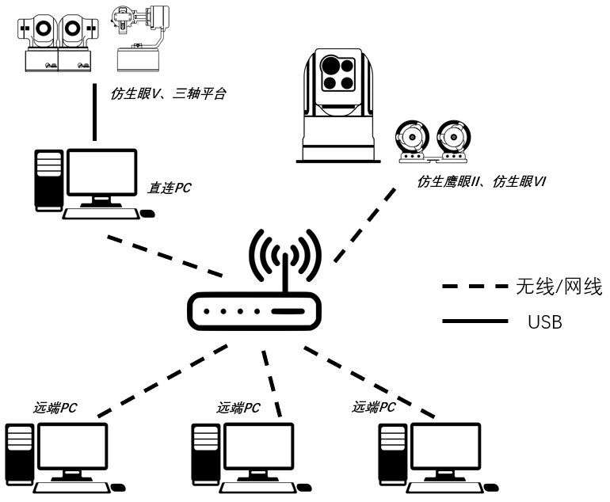

**[爱观（Eyevolution）](https://ilooktech.com/)仿生眼系列产品SDK**

[TOC]

# 1. 仿生眼设备使用简介
## 1.1 直连与远程连接
仿生眼系列设备主要支持直连及远程连接两种使用模式。
> ***直连***：设备通过USB数据线缆（可能会使用多根）直接连接到电脑，通过本SDK与设备进行直接交互与控制，具备最佳的**实时性**，但会占用一部分直连电脑资源用于设备底层功能及远程数据传输等功能
> 
> ***远程连接***：通过网络（有线/无线）连接与设备进行数据交互、控制使用，对于pc性能、接口等无直接要求，可根据应用需求灵活匹配相应算力电脑，但由于增加了数据编解码及网络传输等环节，实时性较低；同时由于需要在网络中传输图片流数据，对于网络带宽有一定要求，建议使用**千兆网络或者5G频段Wifi**连接使用

具体设备及对应支持的连接使用模式如下表所示：
|设备        |构型     |支持用户使用模式    |
|:--:       |:--:     |:--:             |
|仿生眼III   |串联式    |直连+远程          |
|仿生眼V     |串联式    |直连+远程          |
|仿生眼VI    |并联式    |远程              |
|仿生鹰眼I   |串联式    |直连+远程          |
|仿生鹰眼II  |串联式    |远程              |
|三轴平台    |串联式    |直连+远程          |

>***仿生眼连接使用示意图***

## 1.2 N-M模式
仿生眼系列设备支持N个设备与M个远端PC互联使用，即M个远端PC可以任意访问N台在网设备中1台或者多台，但N与M数量受限于所连接网络资源。
>***同步***：仿生眼系列设备均支持**设备内多传感器同步**及**多设备间同步**，同步需要根据对应设备使用说明书使用额外线缆进行连接，完成连接后M个远端PC可获取多台仿生眼系列设备的时间对齐后的数据

>***M个远端PC***：M个远端PC并不要求PC设备一致，甚至可以为支持SDK运行的平板、手机等，后续SDK也会兼容更多平台及语言

>***控制唯一性***：M个远端PC均可设置获取仿生眼系列设备图像数据及各传感器数据，但设备无法同时响应多个远端PC发送的控制指令，目前SDK尚未对这一情况进行特殊处理，这可能导致异常运动或者错误

# 2. SDK运行环境配置
> SDK目前仅支持X86架构平台Ubuntu16.04、Ubuntu18.04、Ubuntu20.04，如需使用其他平台系统请联系[爱观（Eyevolution）技术支持](https://ilooktech.com/)

SDK中部分功能会使用到OpenCV、CUDA等依赖库与软件，对应版本要求如下表所示：

| 依赖库与软件  |   版本    |      是否需要安装       |
|:-------:|:-------:|:-----------------:|
|  cmake  | \>=3.14 |    自行安装，工程编译需要    |
| OpenCV3 | 3.4.11  | 工程自带,提供有无CUDA两种版本 |
| OpenCV4 |  4.7.0  | 工程自带,提供有无CUDA两种版本 |
|  CUDA   |  11.1   | 如需要深度计算等功能需要自行安装  |
|  Eigen  |  3.3.7  |       工程自带        |

## 2.1 直连PC首次使用环境配置
### 2.1.1 建立仿生眼工程
   1) `cd path_to_workspace`
   2) `git clone https://github.com/BinoSense/BionicEyes`
   3) 下载dependencies.zip文件(链接: https://pan.baidu.com/s/1nkJJqHHzsvlzcYILgWhDmg?pwd=1234)，解压至BionicEyes工程根目录下
   4) 如果拥有对应底层代码模块权限，clone相应模块置于BionicEyes/src路径下
   
### 2.1.1 创建仿生眼目录
   1) `sudo mkdir /usr/Evo_BionicEyes`
   2) `sudo chmod 777 /usr/Evo_BionicEyes/`
 
### 2.1.2 安装若干依赖库
   `sudo apt-get install build-essential git libgtk2.0-dev libhdf5-dev pkg-config libavcodec-dev libdc1394-22-dev libavformat-dev libswscale-dev libtbb-dev liblapacke-dev libvtk6-dev libatlas-base-dev`

### 2.1.3 安装相机驱动
   1) 针对仿生眼III:
      - `cd PATH_TO_WORKSPACE/BionicEyes/dependencies/package`
      - `sudo dpkg -i pylon_6.1.1.19861-deb0_amd64.deb`
      - `sudo /opt/pylon/share/pylon/setup-usb.sh`
      - `sudo gedit /etc/security/limits.conf`
      - 在文件末尾添加“*    hard    nofile    4096”
      - `cat /sys/module/usbcore/parameters/usbfs_memory_mb`
      - 确认返回值是不是1000，如果不是可能导致采集图像出现卡顿等异常,请依次执行以下步骤：
      - `sudo /etc/default/grub`
      - 修改GRUB_CMDLINE_LINUX_DEFAULT="quiet splash"：为GRUB_CMDLINE_LINUX_DEFAULT="quiet splash usbcore.usbfs_memory_mb=1000"
      - `sudo update-grub`
   2) 针对仿生眼V、仿生鹰眼I：
      - `cd PATH_TO_WORKSPACE/BionicEyes/dependencies/package`
      - `unzip tiscamera-v-tiscamera-0.14.0.zip`
      - `cd tiscamera-v-tiscamera-0.14.0`
      - `sudo ./scripts/install-dependencies.sh --compilation --runtime`
      - `mkdir build && cd build`
      - `make -j8`
      - `sudo make install`
   3) 三轴平台无需相机驱动，跳过此步
   
### 2.1.4 添加串口权限
   1) `sudo gedit /etc/udev/rules.d/99-serial.rules`
   2) 文件中添加“KERNEL=="ttyUSB*", MODE="0666"”
   3) sudo udevadm control --reload

### 2.1.5 编译
   1)  `cd PATH_TO_WORKSPACE/BionicEyes`
   2)  `mkdir build && cd build`
   3)  `cmake ..`
   4)  `make -j8`
#### cmake options
- **-DBE_COMPILE_V3=<ON/OFF>**
构建支持III代仿生眼相机的相机驱动库，内部使用

- **-DBE_COMPILE_V5=<ON/OFF>**
构建支持V代仿生眼相机/I代仿生鹰眼的相机驱动库，内部使用

- **-DBE_DEP_UPDATE=<ON/OFF>**
是否从仿生眼工程本地更新dependencies文件夹至/usr/Evo_BionicEyes，dependencies文件有更新后，必须执行本操作

- **-DBE_INCLUDE_UPDATE=<ON/OFF>**
是否从仿生眼工程本地更新头文件至/usr/Evo_BionicEyes

- **-DBE_LIB_UPDATE=<ON/OFF>**
是否从仿生眼工程本地更新库文件至/usr/Evo_BionicEyes

- **-DCV_4=<ON/OFF>**
是否使用OpenCV4,否则使用OpenCV3,默认使用Opencv4(opencv依赖库在dependencies文件夹中，无需额外安装)

- **-DBUILD_SAMPLES=<ON/OFF>**
编译Samples,默认ON

- **-DBUILD_TEST=<ON/OFF>**
编译Test，默认ON

### 2.1.6 使用
   > - 所有设备可执行文件位于`PATH_TO_WORKSPACE/BionicEyes/bin/`
   > - 仿生眼系列设备sdk头文件、库文件位于`/usr/Evo_BionicEyes/`

根据对应设备不同，运行相应程序
|设备        |可执行文件                     | 设备依赖库    |
|:--:       |:--:                         | :--:    |
|仿生眼III   |evo_be_Device_*               | libevo_be_Device_shared_*.so|
|仿生眼V     |evo_be_Device_5_*             | libevo_be_Device_5_shared_*.so|
|仿生鹰眼I   |evo_be_EEDevice_*             | libevo_be_EEDevice_shared_*.so|
|三轴平台    |evo_be_Device_ThreeAxis_*     | libevo_be_Device_ThreeAxis_shared_*.so|
***\*代表对应系统平台，例如1804代表ubuntu18.04***

直连PC除运行上述设备程序外，还需要在另一个终端运行**evo_be_Device_Service_\***用于启动仿生眼服务后，才能供远端PC检测到仿生眼系列设备的存在。

如需在直连PC直接开发相关功能，可链接对应设备依赖库（可能还需要链接仿生眼其他封装库，可参考samples），如仍有远端PC需要连接设备，同样需要在另一个终端运行**evo_be_Device_Service_\***用于启动仿生眼服务

## 2.2 远端PC首次使用环境配置
### 2.2.1 建立仿生眼工程
   1) `cd path_to_workspace`
   2) `git clone https://github.com/BinoSense/BionicEyes`
   3) 下载dependencies.zip文件(链接: https://pan.baidu.com/s/1nkJJqHHzsvlzcYILgWhDmg?pwd=1234)，解压至BionicEyes工程根目录下
   4) 如果拥有对应底层代码模块权限，clone相应模块置于BionicEyes/src路径下
   
### 2.2.1 创建仿生眼目录
   1) `sudo mkdir /usr/Evo_BionicEyes`
   2) `sudo chmod 777 /usr/Evo_BionicEyes/`
 
### 2.2.2 安装若干依赖库
   `sudo apt-get install build-essential git libgtk2.0-dev libhdf5-dev pkg-config libavcodec-dev libdc1394-22-dev libavformat-dev libswscale-dev libtbb-dev liblapacke-dev libvtk6-dev libatlas-base-dev`

### 2.2.3 编译
   1)  `cd PATH_TO_WORKSPACE/BionicEyes`
   2)  `mkdir build && cd build`
   3)  `cmake ..`
   4)  `make -j8`
#### cmake options
- **-DBE_COMPILE_V3=<ON/OFF>**
构建支持III代仿生眼相机的相机驱动库，内部使用

- **-DBE_COMPILE_V5=<ON/OFF>**
构建支持V代仿生眼相机/I代仿生鹰眼的相机驱动库，内部使用

- **-DBE_DEP_UPDATE=<ON/OFF>**
是否从仿生眼工程本地更新dependencies文件夹至/usr/Evo_BionicEyes，dependencies文件有更新后，必须执行本操作

- **-DBE_INCLUDE_UPDATE=<ON/OFF>**
是否从仿生眼工程本地更新头文件至/usr/Evo_BionicEyes

- **-DBE_LIB_UPDATE=<ON/OFF>**
是否从仿生眼工程本地更新库文件至/usr/Evo_BionicEyes

- **-DCV_4=<ON/OFF>**
是否使用OpenCV4,否则使用OpenCV3,默认使用Opencv4(opencv依赖库在dependencies文件夹中，无需额外安装)

- **-DBUILD_SAMPLES=<ON/OFF>**
编译Samples,默认ON

- **-DBUILD_TEST=<ON/OFF>**
编译Test，默认ON

### 2.2.4 使用
   > - 所有设备可执行文件位于`PATH_TO_WORKSPACE/BionicEyes/bin/`
   > - 仿生眼系列设备sdk头文件、库文件位于`/usr/Evo_BionicEyes/`

远端PC无论连接何种设备，均链接**libevo_be_BionicEyes_shared_*.so**（可能还需要链接仿生眼其他封装库，可参考samples）
***\*代表对应系统平台，例如1804代表ubuntu18.04***